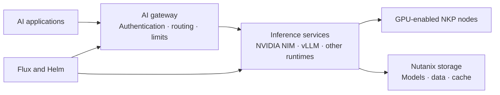

# AI inference on NKP

AI inference is more than scheduling a model on a GPU. A production platform also
needs endpoint management, traffic policy, observability, model distribution,
data access, and reliable storage.

NKP provides a strong foundation because these concerns can be operated through
standard Kubernetes APIs and open source components. Nutanix Enterprise AI adds a
supported control plane for model and inference endpoint operations.

## Reference architecture

This separates the application-facing endpoint from the inference runtime.
Applications do not need to know which model replica, GPU pool, or provider serves
each request.

## Nutanix Enterprise AI

[Nutanix Enterprise AI (NAI)](https://www.nutanix.com/products/nutanix-enterprise-ai)
is a Kubernetes application for deploying, managing, and governing generative AI
models and their endpoints. It can run on NKP and other supported CNCF-conformant
Kubernetes environments.

NAI provides capabilities such as:

- deployment of validated and custom models;
- OpenAI-compatible inference APIs;
- endpoint authentication and role-based access;
- model and endpoint monitoring;
- operation in restricted or air-gapped environments;
- a unified gateway for private and external model endpoints, depending on the
  NAI version.

NKP is a natural runtime for NAI because the same platform team can manage the
Kubernetes lifecycle, GPU worker pools, platform applications, and inference
services through one fleet model.

## Envoy AI Gateway

[Envoy AI Gateway](https://aigateway.envoyproxy.io/) is an open source,
Kubernetes-native gateway for generative AI traffic. It builds on Envoy Proxy and
the Kubernetes Gateway API.

It can provide a common endpoint in front of self-hosted and external models:

- request routing and backend selection;
- authentication to upstream model providers;
- rate and usage limiting;
- failover between inference backends;
- metrics for traffic, latency, and token usage;
- policy that is separate from the inference runtime.

Envoy AI Gateway is not required by NKP and should not be assumed to be bundled
with it. It is an option for platform teams that want to assemble and operate
their own open source inference stack. NAI provides a more integrated and
supported Nutanix experience. Choose based on support requirements, desired
control, and the endpoints you need to manage.

!!! tip "Field note: keep the application API stable"
    Give applications one governed inference endpoint instead of direct access to
    individual model services. Models and runtimes then can change without
    requiring every application team to update its integration.

## Why the Kubernetes foundation matters

NKP supplies the platform capabilities around the model server:

- **Declarative lifecycle:** Cluster API manages clusters and GPU worker pools.
- **Repeatable delivery:** Flux and Helm reconcile gateways, runtimes, and
  supporting services.
- **Scheduling and isolation:** Kubernetes schedules inference workloads onto
  GPU-enabled nodes and separates teams with namespaces and policy.
- **Networking:** CNI policy controls east-west traffic between applications,
  gateways, and model servers.
- **Observability:** platform applications provide infrastructure and workload
  telemetry.
- **Hybrid operation:** the same Kubernetes patterns can be used in a data center,
  cloud, edge, or restricted environment where supported.

Kubernetes does not make inference efficient by itself. Model runtime selection,
GPU sizing, batching, autoscaling, and storage performance still require workload
testing.

## Storage is part of the inference path

GPU capacity often receives the most attention, but storage can determine model
startup time, throughput, recovery behavior, and the ability to scale replicas.
An inference platform may need storage for:

- model weights and runtime artifacts;
- retrieval-augmented generation (RAG) source data and vector indexes;
- shared caches, including key-value cache offload where supported;
- pipeline artifacts and evaluation data;
- application state, logs, and backups.

Nutanix can provide block, file, and object services for these different access
patterns. Nutanix CSI integrates persistent storage with Kubernetes, while
Nutanix Unified Storage can provide shared file and object access for AI data.

For advanced designs, Nutanix documents the use of Nutanix Files with NFS over
RDMA, NVIDIA GPUDirect Storage, and LMCache to reduce data movement in supported
inference architectures. These capabilities require compatible hardware,
networking, software versions, and validation; they are not automatic benefits of
every NKP deployment.

!!! tip "Field note: benchmark the complete data path"
    Test model load time, time to first token, token throughput, and concurrent
    requests with the intended storage and network path. A GPU benchmark that
    reads from local cache does not validate the production architecture.

## Design questions

Before selecting components, answer:

1. Are models self-hosted, externally hosted, or both?
2. Is a supported product required, or will the platform team own the open source
   gateway and model-serving stack?
3. Which API must remain stable for application teams?
4. How are models, RAG data, and caches stored and protected?
5. What are the latency, throughput, availability, and data-sovereignty targets?
6. How will GPU, token, and storage consumption be measured?

## Further reading

- [Nutanix Enterprise AI overview](https://www.nutanix.com/products/nutanix-enterprise-ai)
- [Nutanix Enterprise AI FAQ](https://www.nutanix.com/products/nutanix-enterprise-ai/faq)
- [Envoy AI Gateway documentation](https://aigateway.envoyproxy.io/docs/)
- [NKP AI applications catalog](https://github.com/nutanix-cloud-native/nkp-ai-applications-catalog)
- [Nutanix CSI driver](https://github.com/nutanix/csi-plugin)
