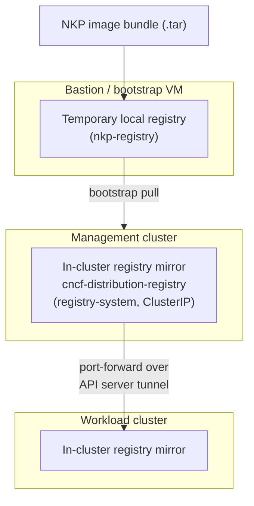

# Air-gapped deployment

An air-gapped NKP environment cannot pull container images or operating system
packages from public services. The required artifacts must be available inside
the restricted network before clusters can be created.

The image-distribution layer is built on open standards: the
**[OCI](https://opencontainers.org/)** image + distribution specs and the
**[CNCF Distribution](https://distribution.github.io/distribution/)** registry
(with **[Harbor](https://goharbor.io/)** as the optional production-grade option).
Synchronization between clusters rides the standard Kubernetes API server tunnel —
no extra network primitives required.

## What changes

Compared with a connected deployment:

- transfer the NKP bundle into the restricted environment;
- provide a node image containing the required operating system packages;
- make every platform image available from an internal registry;
- use internal DNS, NTP, certificate, identity, and storage services;
- define a repeatable process for importing updates.

The Kubernetes and Cluster API architecture does not change. The artifact supply
chain does.

## Image distribution options

NKP offers two primary approaches for air-gapped installations.

### Built-in infrastructure registry

This is the recommended approach for reducing deployment complexity, particularly
on Nutanix AHV. It removes the prerequisite of building and maintaining a
dedicated, external enterprise registry prior to deploying Kubernetes.

- **Built-in registry**: The NKP installation bundle includes a localized internal
  registry mirror.
- **Image bundle**: The NKP bundle supplies the platform images required by the
  cluster.
- **No external registry prerequisite**: You can start deploying without
  relying on pre-existing external infrastructure.

### External private registry

For organizations that already have a standardized enterprise container registry
(Harbor, Artifactory, Nexus, etc.) or strict policies requiring centralized image
management.

- **Custom registry**: You override the internal registry during deployment.
- **Cluster configuration**: NKP is configured to pull platform images from the
  existing registry.

### Where Mindthegap fits

[Mindthegap](https://github.com/mesosphere/mindthegap) is an open source utility
for creating OCI image bundles and importing them into containerd or an OCI
registry. The name can appear in air-gapped tooling and implementation details.

It is not a registry, Kubernetes distribution, management plane, or CRD family.
NKP operators normally use the supported NKP bundle commands and workflows
rather than invoking Mindthegap directly.

## Deep dive: how the simplified architecture works

When using the `--bundle` workflow, NKP handles registry provisioning and image
synchronization automatically across both the management and workload clusters.

### On the bastion VM (bootstrap phase)

1. **Local container**: During initial cluster preparation on the bastion VM, a
   temporary local registry container (typically `nkp-registry`) is started.
2. **Pushing images**: The installation bundle containing all necessary NKP and
   Kubernetes infrastructure components is pushed to this temporary local registry.
3. **Provisioning**: The new management cluster pulls its required images from the
   bastion VM to bootstrap itself.

### On the management cluster

1. **In-cluster registry**: Once provisioned, the management cluster hosts its own
   internal registry mirror. It runs as an internal `ClusterIP` service (e.g.
   `cncf-distribution-registry-docker-registry`) in the `registry-system`
   namespace.
2. **Secure access**: It is not exposed externally via `LoadBalancer` or
   `NodePort`. Images are pushed securely using temporary `kubectl port-forward`
   sessions.
3. **Infrastructure only**: This internal registry is strictly for platform
   components required to lifecycle clusters. (With NKP Pro or Ultimate, a
   production-grade Harbor registry is deployed later to host your actual
   applications.)

### On the workload clusters

1. **Automatic configuration**: When deploying a new workload cluster from the
   management cluster, no extra `--registry-mirror` flags are needed. NKP
   configures the workload cluster automatically.
2. **Local registry instance**: NKP deploys an instance of the internal registry
   mirror directly inside the new workload cluster.
3. **Secure background sync**: A background job on the management cluster securely
   pushes the required infrastructure images to the workload cluster's registry
   using the Kubernetes API server tunnel (`port-forward`).
4. **No network changes**: Because it uses the Kubernetes API tunnel, there is no
   need to open extra firewall ports or establish complex routing for registry
   traffic between clusters.

!!! info "Two registry flags, two audiences"
    - **`--registry-mirror-url`** is used by the cluster **nodes** to pull images.
    - **`--registry-url`** is used by the NKP **platform components** (Kommander,
      catalog apps).

!!! tip "Field note: test the offline path"
    Blocking internet access is the only reliable validation of an air-gapped
    installation. A successful installation while public registries remain
    reachable does not prove that every required artifact is mirrored.

## Installation guide

See [Install an air-gapped NKP 2.18 management cluster](../install/v2.18/airgapped/management-cluster.md)
for the bundle, image, registry, and cluster creation commands.
