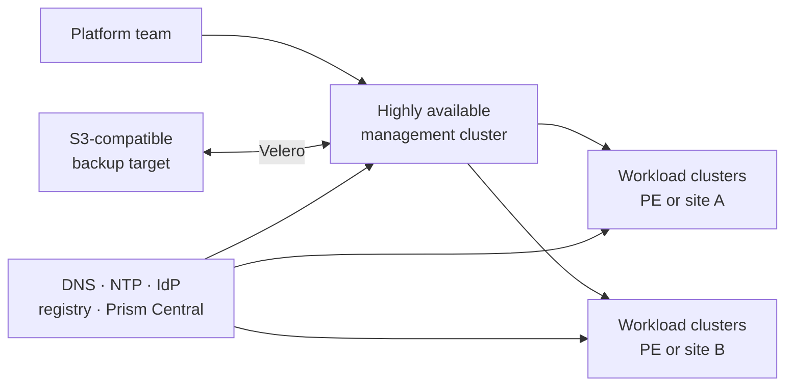

# Availability and recovery

High availability is not only a Kubernetes replica count. An NKP design must
consider the management cluster, Nutanix infrastructure, storage, and external
services as separate failure domains.

## Design at a glance

A single management cluster can manage workload clusters on multiple Prism
Element clusters. Depending on the NKP license, it can also use multiple Prism
Central instances or different infrastructure-provider types.

Where supported by the selected NKP release, Prism Element clusters can be
configured as failure domains for one Kubernetes cluster. This allows control
plane and worker nodes to be distributed across infrastructure boundaries.
Validate network latency, storage topology, and the release compatibility matrix
before selecting this pattern.

## Place the management cluster deliberately

A dedicated Prism Element cluster is optional. The important design principle is
to place the management cluster on stable infrastructure and isolate it
logically from application workloads.

Use these defaults for a production design:

- three control plane nodes;
- at least three worker nodes;
- four worker nodes when the selected local object-storage design requires it;
- VM anti-affinity so replicas do not share one physical host;
- multiple PE failure domains when the infrastructure and NKP release support
  that topology;
- no business applications on the management cluster.

The management cluster can share a PE cluster with workload clusters, but
capacity pressure, maintenance, and failure of that PE then affect both planes.

!!! tip "Field note: separate availability from recovery"
    Spreading VMs across hosts protects against a host failure. Spreading nodes
    across PE clusters protects against a larger infrastructure failure. Backups
    and a tested restore procedure protect against configuration loss,
    corruption, or site loss.

## Understand a management-cluster outage

Existing workload clusters and their applications continue operating when the
management cluster is unavailable. The outage affects central platform
capabilities, including:

- cluster creation, scaling, and upgrades;
- the Kommander UI and centralized fleet views;
- centralized application and policy reconciliation;
- new authentication through management-cluster identity services.

Keep protected administrative kubeconfigs for emergency access to the management
and workload clusters.

## Use a warm-standby recovery pattern

Two management clusters must not actively reconcile the same workload clusters.
For site recovery, use a warm-standby pattern:

1. Keep the recovery environment, infrastructure access, and artifacts ready.
2. Protect management-plane resources with Velero.
3. Create a clean management cluster at the recovery site with the same NKP
   version.
4. Restore the supported resources and reconnect workload clusters by following
   the version-specific recovery procedure.
5. Update DNS, ingress, identity, and operational access.

The standby becomes active only after the original management plane is fenced or
confirmed unavailable. This avoids two control planes reconciling the same
resources.

## Back up the management plane

Use Velero with an S3-compatible object store, such as Nutanix Objects, to
protect:

- workspaces and projects;
- Cluster API resources and infrastructure credentials;
- Kommander configuration;
- Flux and other declarative application state;
- Kubernetes secrets and certificates;
- selected persistent volumes when their history is required.

Do not treat a raw etcd snapshot as the primary management-cluster recovery
method. Restoring stale etcd state can conflict with Cluster API and GitOps
reconciliation.

A daily backup is a useful baseline. Also create an ad-hoc backup before an NKP
upgrade, a major cluster change, or a significant GitOps update. Retention,
encryption, and restore-test frequency must follow the required RPO and RTO.

!!! warning "A backup is not proven until it is restored"
    Regularly test recovery into an isolated environment. Verify workspace
    namespaces, credentials, certificates, Cluster API objects, and access to
    attached or managed workload clusters.

## Protect workload data separately

Management-plane backup does not replace application-data protection. Select the
appropriate combination of Velero, CSI snapshots, Nutanix storage protection,
and Nutanix Data Services for Kubernetes for each workload.

NKP 2.18 uses CSI 3.x and can use hypervisor-attached volumes. These volumes are
not the path for synchronous NDK replication. Designs requiring synchronous
replication must use the supported iSCSI-based storage path and be validated as
an end-to-end solution.

## Make dependencies redundant

An HA Kubernetes cluster still depends on services outside Kubernetes. Include
these in the availability design:

- scale-out or site-resilient Prism Central;
- DNS and NTP;
- identity providers and emergency local access;
- image and Helm registries;
- S3-compatible backup storage;
- Git repositories used by Flux;
- load balancer addresses, routing, and certificates.

Document which component owns each recovery action. The most useful design
artifact is a failure matrix showing what survives a host, PE, Prism Central,
management-cluster, registry, or complete-site outage.

!!! note "Version and license scope"
    Multi-infrastructure-provider support, failure-domain layouts, storage
    behavior, and recovery commands depend on the NKP release and license.
    Confirm the design against the compatibility matrix and support guidance
    before implementation.
