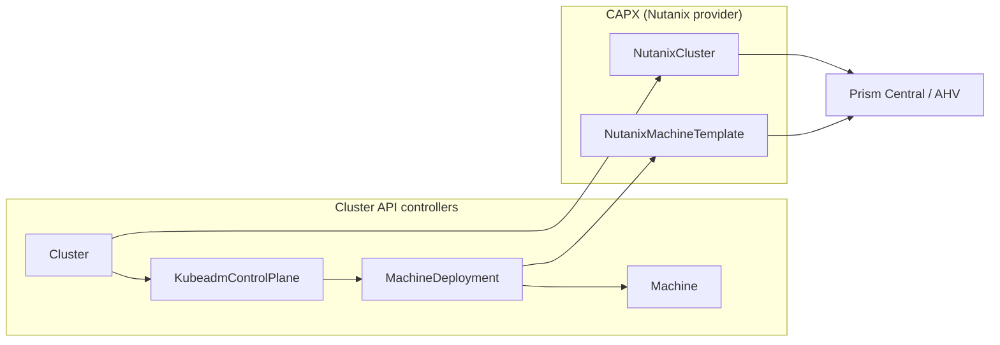

# Cluster lifecycle

NKP uses [Cluster API](https://cluster-api.sigs.k8s.io/) to represent clusters as
Kubernetes resources. On Nutanix infrastructure, the
[Cluster API Provider Nutanix (CAPX)](https://github.com/nutanix-cloud-native/cluster-api-provider-nutanix)
translates those resources into Prism Central operations.

## Reconciliation model

Cluster API brings the Kubernetes reconciliation model to Kubernetes clusters
themselves. You describe the *desired state* of a cluster (`Cluster`,
`MachineDeployment`, `KubeadmControlPlane`, and provider-specific objects) as
Kubernetes resources, and a set of controllers continuously reconcile the real
infrastructure to match. NKP uses this as its lifecycle engine instead of bespoke
provisioning scripts.

## Bootstrap and pivot

The first cluster is special: there is no management cluster yet to run Cluster
API. NKP uses the standard Cluster API **pivot** pattern:

1. The `nkp` CLI starts a local **[kind](https://kind.sigs.k8s.io/)** cluster on
   the jump/bootstrap host and installs the Cluster API + CAPX controllers into it.
2. CAPX talks to Prism Central to provision the control-plane and worker VMs of
   the real cluster.
3. Core add-ons (CNI, CSI, etc.) are installed onto the new cluster.
4. The Cluster API objects and controllers are **moved (pivoted)** from the kind
   cluster into the new cluster, which becomes **self-managed**.
5. The temporary kind cluster is discarded.

The `--self-managed` option triggers this pivot when you create a management
cluster.

## Node images (Kubernetes Image Builder)

Cluster nodes boot from purpose-built OS images produced by upstream
**[Kubernetes Image Builder](https://github.com/kubernetes-sigs/image-builder)**.
NKP ships CIS-hardened Rocky Linux and Ubuntu qcow2 images with the correct
kubelet, containerd, and dependency versions baked in. In air-gapped mode these
images can also embed the required operating system packages so nodes do not need
internet access during provisioning.

## Day 2 operations

Because clusters are Cluster API objects, Day 2 changes are declarative edits
reconciled by controllers:

| Operation | Mechanism |
| --- | --- |
| **Scale** | Change `replicas` on the `MachineDeployment` / control plane. |
| **Upgrade** | Roll the Kubernetes version + node image; CAPI does rolling replacement. |
| **Repair** | MachineHealthChecks detect and replace unhealthy nodes. |
| **Delete** | Delete the `Cluster` object; CAPX tears down the AHV VMs. |

This is the same model whether the target is Nutanix AHV, a public cloud, or
vSphere — only the infrastructure provider changes.

!!! tip "Field note: inspect desired state first"
    When provisioning stalls, inspect the Cluster API resources and controller
    conditions before checking individual virtual machines. The conditions
    usually identify which reconciliation step is blocked.

## Related guides

- [Install an NKP 2.18 management cluster](../install/v2.18/standard/management-cluster.md)
- [Install an air-gapped management cluster](../install/v2.18/airgapped/management-cluster.md)
- [Understand cluster types](clusters.md)
