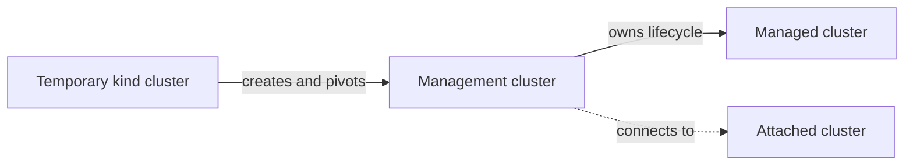

# Clusters

NKP uses one management cluster to operate a fleet of Kubernetes clusters. A
cluster's type describes how it relates to that management cluster.

## Cluster types

### Management cluster

The management cluster hosts Kommander and the controllers used for fleet
operations. It provides the NKP UI and APIs and stores the desired state for
managed clusters and platform applications.

Treat the management cluster as shared platform infrastructure. Application
workloads should normally run on workload clusters.

### Managed cluster

A managed cluster is created through NKP. Cluster API manages its lifecycle,
including provisioning, scaling, upgrades, and deletion.

Use a managed cluster when NKP should own both the Kubernetes cluster and its
underlying infrastructure.

### Attached cluster

An attached cluster was created outside NKP and then connected to the management
cluster. NKP can provide supported fleet services, such as visibility and
application management, but it does not own the cluster's infrastructure
lifecycle.

Use an attached cluster when another tool or team remains responsible for
provisioning and upgrading it.

## Bootstrap cluster

During initial management cluster creation, the `nkp` CLI creates a temporary
[kind](https://kind.sigs.k8s.io/) cluster on the bootstrap host. Cluster API runs
there until the management cluster is ready. NKP then moves the lifecycle
resources to the management cluster and removes the temporary cluster.

The bootstrap cluster is an implementation detail, not a fleet member.

## Choose a cluster type

- Choose a **managed cluster** for consistent, declarative lifecycle management.
- Choose an **attached cluster** when the cluster already exists or another
  system owns its lifecycle.
- Use the **management cluster** for NKP services and fleet administration.

## Next steps

- Learn how [Cluster API manages cluster lifecycle](cluster-lifecycle.md).
- Learn how [workspaces and projects](workspaces-and-projects.md) organize the
  fleet.
- Plan [availability, backup, and recovery](availability-and-recovery.md).
