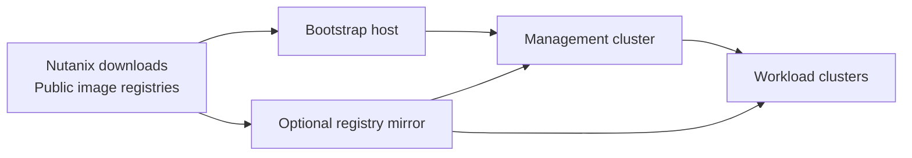

# Connected deployment

In a connected deployment, the bootstrap host and cluster nodes can reach the
external services required by NKP. Access may be direct or pass through an
enterprise proxy or registry cache.

## Artifact flow

The bootstrap host downloads or receives the NKP bundle and uses its bootstrap
image to create the management cluster. Cluster nodes then pull required images
from public registries or a configured mirror.

## Direct access or registry mirror

### Direct access

Direct registry access is the simplest model. It has fewer components but makes
cluster availability dependent on external registries, DNS, and network paths.
It can also encounter public registry rate limits.

### Registry mirror or proxy cache

An enterprise mirror gives platform teams more control over image availability,
audit, scanning, and external bandwidth. It also provides a transition path
toward a restricted environment.

A mirror is useful even when internet access is available. It should be treated
as production infrastructure and sized for concurrent node provisioning.

## Required supporting services

Clusters generally need reliable access to:

- DNS and NTP;
- Prism Central and the target AHV environment;
- the selected container registries;
- identity and certificate services;
- storage endpoints;
- Git, Helm, or OCI sources used by platform applications.

The exact endpoints depend on the NKP release and enabled applications.

!!! tip "Field note: connected does not mean unrestricted"
    Use explicit allowlists and a registry mirror instead of broad outbound
    access where possible. Validate access from the bootstrap host and from a
    cluster node; the two systems do not always follow the same network path.

## Installation guide

See [Install an NKP 2.18 management cluster](../install/v2.18/standard/management-cluster.md)
for the field procedure.
