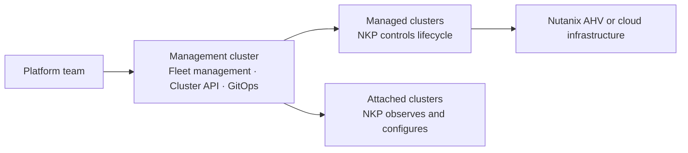

# NKP architecture

Nutanix Kubernetes Platform (NKP) provides a consistent way to create, operate,
and govern Kubernetes clusters. It combines upstream Kubernetes APIs with a
central management plane and integrations for the target infrastructure.

## Architecture at a glance

The **management cluster** is the control point for the fleet. It stores desired
state and runs controllers that reconcile clusters and platform applications.
Workloads run on managed or attached clusters.

## Main building blocks

### Kubernetes distribution

NKP clusters use upstream Kubernetes and standard interfaces such as the
Container Network Interface (CNI), Container Storage Interface (CSI), and Open
Container Initiative (OCI) specifications. NKP selects and tests compatible
versions of the required components.

### Multi-cluster management

Kommander provides the management experience. Platform teams use it to organize
clusters, delegate access, deploy platform applications, and view fleet health.
The main organizational concepts are [workspaces and projects](workspaces-and-projects.md).

### Declarative operations

NKP uses Kubernetes controllers instead of a separate proprietary lifecycle API:

- [Cluster API](cluster-lifecycle.md) reconciles cluster infrastructure.
- [Flux](platform-applications.md) reconciles platform applications.
- Kubernetes APIs represent configuration, policy, and access control.

This approach makes desired state inspectable with standard Kubernetes tools.

## Where to continue

- [Clusters](clusters.md): understand management, managed, attached, and
  bootstrap clusters.
- [Workspaces and projects](workspaces-and-projects.md): understand the
  organizational hierarchy.
- [Cluster lifecycle](cluster-lifecycle.md): learn how Cluster API and CAPX
  create and update clusters.
- [AI inference](ai-inference.md): see how NKP, inference gateways, GPU workers,
  and Nutanix storage fit together.
- [Availability and recovery](availability-and-recovery.md): design management
  cluster placement, failure domains, backups, and site recovery.
- [Deployment models](deployment-models.md): compare connected, restricted, and
  air-gapped environments.
- [Open source components](open-source-primitives.md): find the upstream
  projects behind NKP capabilities.

!!! note "Version scope"
    The architecture is stable across recent NKP releases, but bundled component
    versions and optional applications vary. Check the release-specific
    compatibility matrix before making implementation decisions.
