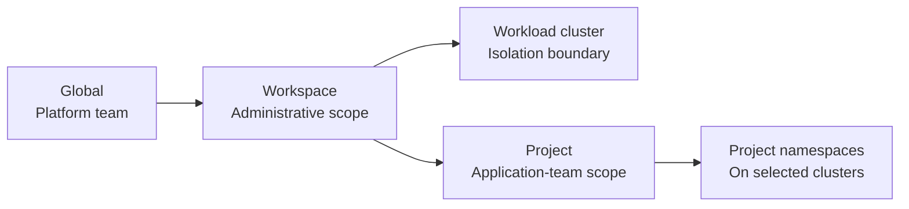

# Multi-tenancy

Multi-tenancy means that teams or customers share part of a Kubernetes platform
while remaining separated in the areas that matter: access, network traffic,
capacity, policy, data, and operational responsibility.

Kubernetes does not provide one complete tenant object. A multi-tenant design
combines standard Kubernetes controls and chooses the correct cluster boundary
for the trust model.

## Start with the isolation boundary

There are two practical patterns for NKP environments:

### Shared cluster

Multiple teams run workloads in one Kubernetes cluster. Each application or team
uses one or more namespaces.

This model provides efficient resource use and works well for internal teams with
a shared trust level. The Kubernetes API server, worker nodes, cluster-scoped
resources, and failure domain remain shared.

### Dedicated cluster

A team, business unit, environment, or customer receives a separate workload
cluster.

This provides independent Kubernetes APIs, upgrades, cluster-wide configuration,
capacity, and failure boundaries. It is the safer choice for untrusted workloads,
regulatory separation, or teams that require cluster administrator access.

The trade-off is the additional infrastructure and operational lifecycle for
each cluster. NKP fleet management helps operate these clusters consistently.

!!! warning "A namespace is not a complete security boundary"
    Namespaces scope many Kubernetes objects, but they do not isolate nodes,
    PersistentVolumes, StorageClasses, CRDs, ClusterRoles, or admission webhooks.
    Network traffic between namespaces is also allowed unless policy restricts
    it.

## Controls for a shared cluster

Namespace-based multi-tenancy requires several independent controls.

### Identity and API access

- Map identity-provider groups to Kubernetes RBAC.
- Use namespace-scoped `Role` and `RoleBinding` objects where possible.
- Grant users and automation only the permissions they require.
- Restrict cluster-wide RBAC and access to cluster-scoped resources.
- Use separate service accounts for each application.

### Network separation

- Apply default-deny ingress and egress `NetworkPolicy` to application
  namespaces.
- Explicitly allow DNS, ingress, observability, storage, and required
  service-to-service traffic.
- Confirm that the selected CNI enforces the required policies.

Do not use a worker VLAN as a substitute for these controls. VLANs follow node
VMs, while pods move between eligible nodes. See
[Worker VLANs](networking.md#worker-vlans) for cases where separate node-pool
subnets are appropriate.

### Capacity and noisy neighbors

- Use `ResourceQuota` to constrain CPU, memory, storage, and object counts.
- Use `LimitRange` to provide or enforce workload defaults.
- Require realistic requests and limits.
- Use separate node pools when workloads require dedicated capacity or hardware.

### Workload policy

- Apply the appropriate
  [Pod Security Standard](https://kubernetes.io/docs/concepts/security/pod-security-standards/).
- Restrict privileged workloads, host namespaces, host paths, and unnecessary
  Linux capabilities.
- Introduce policy in audit or warning mode before enforcing it.

### Data and platform visibility

- Scope Secrets and external secret access to the application team.
- Define approved storage classes, snapshot behavior, and retention.
- Restrict access to logs, metrics, traces, backups, and cost information.
- Treat cluster-wide observability and backup services as privileged.

## How NKP supports the model

NKP combines cluster boundaries with
[workspaces and projects](workspaces-and-projects.md):

### Workspaces organize clusters

A workspace groups clusters under a durable administrative boundary such as a
business unit, environment, region, or platform team. Access and platform
applications can be scoped at this level.

### Projects organize applications

A project gives an application team a consistent namespace and configuration
scope across selected clusters in its workspace. It can scope access, quotas,
Secrets, and application configuration.

A project does not create a separate Kubernetes control plane. Its workload
isolation depends on the Kubernetes controls applied to the project namespaces.

### Clusters provide the stronger boundary

Use dedicated workload clusters when tenants require:

- independent cluster administration or CRDs;
- separate Kubernetes or platform upgrade schedules;
- stronger security or compliance separation;
- dedicated capacity, networking, or infrastructure credentials;
- independent maintenance and failure boundaries.

Projects can still separate applications inside a dedicated cluster.

## Common NKP designs

### Internal application teams

Use a shared workload cluster with projects, namespace RBAC, quotas,
default-deny network policy, and workload policy.

### Business units

Use one workspace for each durable administrative boundary. Assign one or more
workload clusters to the workspace, then use projects for its application teams.

### Production and non-production

Use separate clusters when production requires different access, maintenance,
capacity, or failure boundaries. Separate workspaces can also make delegated
administration clearer.

### External or untrusted tenants

Prefer dedicated clusters. Namespace controls reduce risk inside a shared cluster
but do not provide the same boundary as an independent Kubernetes cluster.

## Design questions

Before selecting a model, answer:

1. Are the tenants internal teams or external customers?
2. Can they run unreviewed or privileged workloads?
3. Do they require cluster-wide resources or administrator access?
4. Which network paths are allowed between tenants and shared services?
5. How are CPU, memory, GPU, and storage constrained?
6. Can one tenant view another tenant's logs, metrics, Secrets, or backups?
7. Do tenants need independent upgrade or maintenance schedules?
8. Does policy require separate clusters or infrastructure credentials?

!!! tip "Field note: use each boundary for its purpose"
    Use workspaces for administration, projects for application teams,
    Kubernetes policy for shared-cluster controls, and workload clusters for
    stronger isolation.

## Further reading

- [Kubernetes multi-tenancy](https://kubernetes.io/docs/concepts/security/multi-tenancy/)
- [Kubernetes namespaces](https://kubernetes.io/docs/concepts/overview/working-with-objects/namespaces/)
- [Kubernetes RBAC](https://kubernetes.io/docs/reference/access-authn-authz/rbac/)
- [Kubernetes resource quotas](https://kubernetes.io/docs/concepts/policy/resource-quotas/)
- [Kubernetes network policies](https://kubernetes.io/docs/concepts/services-networking/network-policies/)
