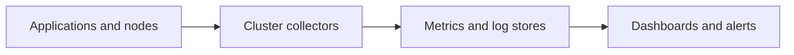

# Observability

NKP provides observability as a set of platform applications. Metrics, logs, and
alerts are collected on workload clusters and presented through the management
experience.

## Data flow

The exact application set depends on the NKP release and license. Common open
source building blocks include:

- [Prometheus](https://prometheus.io/) for metrics and alert rules;
- [Grafana](https://grafana.com/oss/grafana/) for dashboards;
- [Fluent Bit](https://fluentbit.io/) for log collection;
- [Alertmanager](https://prometheus.io/docs/alerting/latest/alertmanager/) for
  alert routing.

## Cluster-local and centralized views

Each cluster remains the source of its operational data. The management plane can
provide a fleet-level view so platform teams can identify affected clusters and
then investigate locally.

This design has two useful properties:

1. Workload clusters continue to collect data independently.
2. The management cluster provides a common entry point for fleet operations.

## Responsibilities

NKP installs and configures the supported observability applications, but platform
teams still need to decide:

- retention periods and storage capacity;
- external notification routes;
- application-specific metrics and dashboards;
- access to logs and dashboards;
- integration with an existing enterprise observability platform.

!!! tip "Field note: plan storage before enabling everything"
    Metrics and logs can consume significant storage. Start with retention and
    capacity requirements, then enable the platform applications needed for each
    cluster. Do not treat default settings as a production sizing decision.

## Related concepts

- [Platform applications](platform-applications.md)
- [Storage](storage.md)
- [Workspaces and projects](workspaces-and-projects.md)
