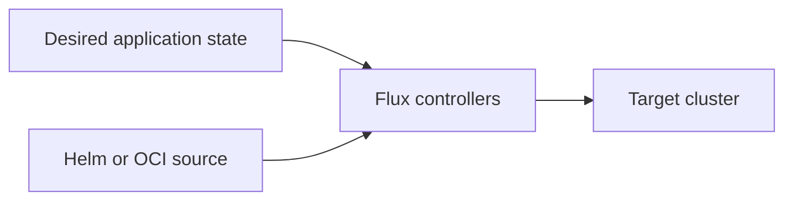

# Platform applications

Platform applications add operational capabilities to a Kubernetes cluster.
Examples include monitoring, logging, backup, policy, and ingress. NKP manages
these applications declaratively instead of treating them as one-time
installations.

## How application delivery works

NKP uses [Flux](https://fluxcd.io/) and [Helm](https://helm.sh/) as the main open
source building blocks for application delivery.

The management cluster stores the desired application state. Flux compares that
state with the target cluster and reconciles differences. This provides:

- repeatable installation across clusters;
- automatic correction of configuration drift;
- versioned configuration;
- standard Kubernetes and Flux resources that operators can inspect.

## Platform applications and catalog applications

**Platform applications** support cluster operations. NKP supplies and tests
their configuration as part of the platform.

**Catalog applications** are optional applications made available to platform or
application teams. Their availability depends on the configured catalogs and NKP
edition.

Keep platform capabilities separate from business workloads. This makes ownership,
upgrades, and troubleshooting clearer.

## Application scope

An application can be enabled at different scopes:

- the management cluster;
- a workspace and its clusters;
- an individual cluster;
- a project, where supported.

Use the broadest scope only when every selected cluster needs the same application
and configuration. Apply cluster-specific overrides sparingly.

!!! tip "Field note: declare overrides, do not patch workloads"
    Avoid editing resources generated by Flux directly. The next reconciliation
    can replace those edits. Change the NKP application configuration or the
    source in Git so the declared state remains the source of truth.

## Related concepts

- [Workspaces and projects](workspaces-and-projects.md)
- [Observability](observability.md)
- [Air-gapped deployment](air-gapped.md)
