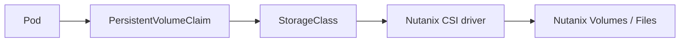

# Storage

Persistent storage in NKP uses the
[Container Storage Interface (CSI)](https://kubernetes-csi.github.io/docs/). On
Nutanix infrastructure, the
[Nutanix CSI driver](https://github.com/nutanix/csi-plugin) implements this
interface for Nutanix storage services.

## The CSI model

CSI decouples storage vendors from the Kubernetes core. A driver implements a set
of gRPC services (controller + node plugins), and Kubernetes uses standard objects
to consume them:

| Object | Role |
| --- | --- |
| **StorageClass** | Defines a tier/profile (e.g. Nutanix Volumes) and provisioner. |
| **PersistentVolumeClaim** | A workload's request for storage. |
| **PersistentVolume** | The provisioned volume bound to the claim. |
| **VolumeSnapshot** | Point-in-time snapshot via the CSI snapshotter. |

## What NKP provides by default

- A **default `StorageClass`** backed by the Nutanix CSI driver, so `PVC`s bind
  without extra configuration.
- Dynamic provisioning against the Nutanix storage container selected during
  cluster creation.
- Snapshots through the upstream
  [external-snapshotter](https://github.com/kubernetes-csi/external-snapshotter),
  enabling `VolumeSnapshot` / `VolumeSnapshotClass` workflows.

## Access modes

| Backend | Typical access modes |
| --- | --- |
| Nutanix Volumes (block) | `ReadWriteOnce` |
| Nutanix Files (NFS) | `ReadWriteMany` |

Choose the backend/StorageClass based on whether workloads need shared
(`ReadWriteMany`) access.

!!! tip "Portability"
    Because these are standard CSI objects, storage manifests move cleanly between
    NKP and any other conformant Kubernetes cluster — only the `StorageClass`
    (and thus the backing driver) changes.

!!! tip "Field note: make the StorageClass explicit"
    Production manifests should set `storageClassName` explicitly. Depending on a
    cluster's default `StorageClass` makes workload behavior less predictable
    across clusters and during storage migrations.
