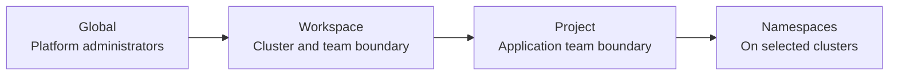

# Workspaces and projects

NKP uses workspaces and projects to organize clusters, teams, and access. They
provide structure above standard Kubernetes namespaces without changing how
applications use Kubernetes.

## The hierarchy

## Workspaces

A workspace groups clusters that share an administrative boundary. A workspace
can represent a business unit, environment, region, or platform team.

Use workspaces to scope:

- clusters;
- platform applications;
- role-based access control;
- projects.

The global scope gives platform administrators visibility across all workspaces.
Workspace administrators operate only within their assigned workspace.

!!! example "Common workspace models"
    - Separate production and non-production clusters.
    - Separate clusters by business unit.
    - Separate clusters by region or regulatory boundary.

## Projects

A project gives an application team a consistent namespace and configuration
boundary across selected clusters in a workspace. Projects can scope resources
such as access control, quotas, secrets, and application configuration.

A project does not create a Kubernetes cluster. It selects existing clusters in
its workspace and creates the project namespace where required.

## How the concepts fit together

Consider a platform team operating clusters in two environments:

1. The team creates `production` and `development` workspaces.
2. Each workspace contains the clusters for that environment.
3. The team creates a `payments` project in both workspaces.
4. Developers receive access to the project, not unrestricted access to every
   cluster.

This separates fleet administration from application-team access.

!!! tip "Field note: design workspaces first"
    Decide the workspace boundaries before attaching many clusters. A workspace
    should represent a durable ownership or governance boundary, not a temporary
    application grouping. Use projects for application teams and workloads.

## Related guides

- [Create a workspace](../install/v2.18/standard/workspace.md)
- [Create a workload cluster](../install/v2.18/standard/workload-cluster.md)
- [Create a project](../install/v2.18/standard/project.md)
