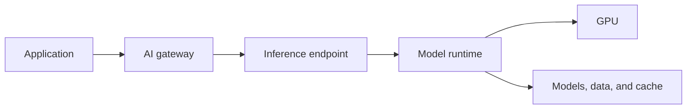

# AI inference fundamentals

## In one minute

Inference is the use of a trained model to produce a result. For a large language
model (LLM), an application sends a prompt to an inference endpoint and receives
generated tokens.

Kubernetes does not perform inference. It schedules and operates the model
servers, gateways, storage integrations, and supporting services that do.

## The request path

Each layer has a different responsibility:

- The **application** sends prompts and consumes responses.
- The **AI gateway** applies routing, authentication, limits, and policy.
- The **inference endpoint** provides a stable API for a model service.
- The **model runtime** loads the model and executes inference.
- The **GPU** performs accelerated computation.
- **Storage** supplies model artifacts, data, and persistent or shared state.

## Model, runtime, and endpoint

A **model** is a set of learned parameters and its associated metadata. Model
weights can consume many gigabytes of storage and GPU memory.

An **inference runtime** is software such as NVIDIA NIM or vLLM that loads a model
and serves requests.

An **endpoint** is the API exposed to applications. Several runtime replicas can
serve one logical endpoint.

Keeping these concepts separate lets platform teams change a runtime, model
version, or replica count without changing every application.

## Tokens and context

LLMs process text as **tokens**, not characters or words. Usage, throughput, and
limits are commonly measured in tokens.

The **context window** is the token content available to a model for one request.
It includes the prompt, system instructions, retrieved information, tool results,
and generated output.

Larger context can increase memory consumption and time to first token. Sending
all available information is not automatically better than selecting relevant
context.

## KV cache

During generation, transformer runtimes store attention data in a **key-value
(KV) cache**. Reusing this data avoids recomputing earlier tokens.

KV cache consumes valuable GPU memory. Some architectures can place cache tiers
in CPU memory or shared storage. This can support longer contexts or more
concurrent requests, but adds a data path that must meet latency and throughput
requirements.

## Important performance signals

### Time to first token

Time to first token measures how long a user waits before generation begins. It
is affected by queueing, model loading, prompt length, cache state, storage, and
runtime behavior.

### Inter-token latency

Inter-token latency measures the delay between generated tokens. It influences
the perceived speed of streamed responses.

### Throughput

Throughput measures tokens or requests served over time. Optimizing throughput
can conflict with minimizing latency for an individual request.

### Concurrency

Concurrency is the number of requests processed at the same time. GPU memory,
batching, context length, and runtime configuration constrain it.

Measure these signals together. GPU utilization alone does not describe the user
experience.

## Batching and scaling

Inference runtimes can combine several requests into a **batch** to use the GPU
more efficiently. Larger batches can improve total throughput but may increase
queueing latency.

Scaling has two levels:

- **Model-server scaling:** add or remove inference replicas.
- **Cluster scaling:** add or remove GPU-capable nodes.

Adding pods does not help when no GPU capacity is available. Adding GPU nodes does
not help when model replicas, quotas, or routing remain unchanged.

## Why an AI gateway is different

A traditional load balancer routes network requests. An AI gateway can also
understand model- and provider-specific concerns:

- route by model name or policy;
- select private or external providers;
- authenticate applications and upstream providers;
- limit requests or token usage;
- provide failover;
- collect model, latency, and usage telemetry.

[Envoy AI Gateway](https://aigateway.envoyproxy.io/) is one open source,
Kubernetes-native option. Nutanix Enterprise AI provides an integrated Nutanix
experience for model and endpoint management.

## RAG and vector search

Retrieval-augmented generation (RAG) adds selected enterprise information to a
prompt:

1. Content is ingested and divided into useful chunks.
2. An embedding model converts content into vectors.
3. A vector database finds content related to a query.
4. The selected content is added to the model context.
5. The inference runtime generates a response.

RAG does not train the foundation model. It supplies relevant context at request
time. Its quality depends on ingestion, chunking, metadata, retrieval, access
control, and data freshness.

## Why storage matters

Inference platforms need storage for:

- model weights and runtime artifacts;
- RAG source data and vector indexes;
- shared caches;
- pipeline and evaluation artifacts;
- logs, backups, and application state.

Model startup can be limited by how quickly weights reach the runtime. RAG can be
limited by retrieval latency. Shared cache designs can be limited by network and
storage throughput.

Choose block, file, or object services based on the access pattern. Do not select
storage only by capacity.

## The role of Kubernetes

Kubernetes contributes:

- GPU-aware scheduling and node selection;
- health probes and replacement of failed replicas;
- services and gateway integration;
- declarative configuration and secrets;
- persistent storage through CSI;
- controlled rollouts;
- metrics and logs;
- namespaces, quotas, and policy.

Kubernetes does not decide which model is accurate, how much GPU memory it needs,
or whether the inference design meets latency targets. Those require model- and
workload-specific validation.

!!! tip "Field note: test cold and warm behavior"
    Test a cold model start as well as a warm steady state. Local caches can make
    a demonstration look fast while hiding the model-distribution and storage
    behavior that determines recovery and scale-out time.

## Continue

- [AI inference on NKP](../architecture/ai-inference.md)
- [Storage architecture](../architecture/storage.md)
- [Observability](../architecture/observability.md)
- [Open source components](../architecture/open-source-primitives.md)
