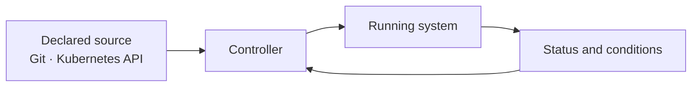

# Cloud native for system engineers

## In one minute

Cloud native describes an operating model, not a location. A workload does not
become cloud native merely because it runs in a container or public cloud.

Cloud native systems use APIs, declared desired state, automation, replaceable
components, and observable behavior to operate reliably at scale.

## Why this matters for NKP

NKP is built around controllers. Cluster API, Kubernetes, and Flux continuously
compare desired state with actual state and reconcile differences.

This makes the platform repeatable, but only when teams change the declared
source instead of bypassing it with manual fixes.

## Core operating principles

### Declare the outcome

Describe what should exist: the cluster version, replica count, application
release, policy, or storage request. Let controllers determine the actions
required to reach that state.

This is different from a runbook containing only a sequence of imperative steps.
The declared state remains after the command has finished.

### Reconcile continuously

Controllers do not run once. They continue to observe the system. If actual state
drifts, they act again.

Operational questions therefore include:

- Which controller owns this resource?
- Where is its desired state stored?
- Which condition prevents reconciliation?

### Prefer replacement over hidden change

Build a new container or node image rather than making undocumented changes to a
running instance. Replacement creates a repeatable path for scaling and recovery.

Not every component can be replaced without planning. Databases and other
stateful systems need stable identity, storage, replication, and backup.

### Design for failure

Assume that pods, nodes, networks, and dependencies can fail. Availability comes
from replicas, failure domains, health checks, controlled disruption, and tested
recovery—not from assuming an individual instance will remain healthy.

### Expose health and behavior

The platform needs signals it can act on:

- readiness: can this instance receive traffic?
- liveness: should this instance be restarted?
- startup: has slow initialization completed?
- metrics, logs, and traces: what is the system doing?
- Kubernetes conditions and events: why is reconciliation blocked?

Monitoring only CPU and memory is not enough to understand an application.

### Automate through APIs

Kubernetes resources, Cluster API objects, Flux resources, and CI/CD systems
provide automation interfaces. Prefer these stable APIs over UI-only procedures
or manual changes that cannot be reviewed and repeated.

## What cloud native does not mean

Cloud native does not automatically provide:

- application high availability;
- correct resource sizing;
- persistent data protection;
- secure network policy;
- zero-downtime upgrades;
- useful observability;
- lower cost.

The platform provides mechanisms. Application and platform teams must choose and
validate the design.

## Shared responsibility

**Infrastructure teams** provide reliable compute, network, storage, identity,
and failure domains.

**Platform teams** provide Kubernetes clusters, policies, platform services,
upgrade paths, and developer interfaces.

**Application teams** provide healthy containers, resource requests, probes,
scaling behavior, data consistency, and application-level telemetry.

Unclear ownership between these groups is a larger operational risk than many
individual technology choices.

!!! tip "Field note: automate the second occurrence"
    A manual investigation can be appropriate while learning. If the same change
    or recovery action is needed again, move it into declared configuration,
    policy, or automation.

## Deep dive: pets and cattle is incomplete

The common “pets versus cattle” analogy helps explain replaceable compute, but it
can hide important state. A better distinction is:

- **reconstructable state:** images, manifests, policies, and configuration held
  in a trusted source;
- **persistent business state:** databases, object data, model artifacts, and
  secrets that need protection;
- **runtime state:** pods, caches, and temporary resources that can be recreated.

Design recovery for each category instead of labeling an entire system
disposable.

## Continue

- [Kubernetes fundamentals](kubernetes-fundamentals.md)
- [NKP in 10 minutes](nkp-in-10-minutes.md)
- [Platform applications](../architecture/platform-applications.md)
