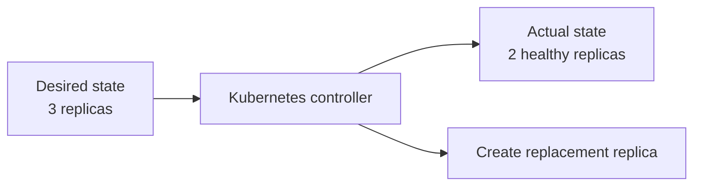

# From VMs to Kubernetes

## In one minute

A Kubernetes workload is not a smaller virtual machine. Kubernetes assumes that
application instances can be recreated, rescheduled, and scaled from declared
configuration. The platform continuously reconciles this desired state.

Virtual machines remain important: NKP commonly runs Kubernetes nodes as VMs on
Nutanix AHV. What changes is how applications above those nodes are operated.

## The key shift

Traditional infrastructure operations often focus on preserving and repairing a
specific server. Kubernetes focuses on maintaining the required application
state, even when individual instances disappear.

This does not mean that everything is disposable. Data, identity, policy, and
declared configuration still require protection. The replaceable part is the
application instance, not the business state it serves.

## Familiar concepts and where the analogy breaks

### A pod is not a VM

A pod is the smallest Kubernetes scheduling unit. It contains one or more
containers that share networking and storage context.

A pod normally:

- has no expectation of a permanent name or IP address;
- is created by a higher-level controller;
- can be replaced on another node;
- receives configuration and storage through Kubernetes resources.

Do not administer pods as long-lived servers. Change the owning `Deployment`,
`StatefulSet`, Helm release, or Git source.

### A container image is not a fully managed VM template

Both package software for repeatable deployment, but a container image normally
contains the application and its runtime dependencies—not a complete operating
system to patch and administer.

Build a new image for an application change. Do not log into a running container
and treat the modification as persistent configuration.

### A Kubernetes node is closer to a VM

A node supplies CPU, memory, networking, and local resources to pods. On NKP, a
node is commonly an AHV virtual machine created from a supported node image.

Node maintenance still matters, but Cluster API can replace nodes through a
rolling lifecycle instead of requiring every node to be repaired indefinitely.

### A Service is not the application instance

A Kubernetes `Service` gives clients a stable network identity while the pods
behind it change. Ingress or Gateway API resources provide application-level
routing from outside the cluster.

Do not configure consumers with individual pod IP addresses.

### A PersistentVolume is not simply a virtual disk

A workload requests storage through a `PersistentVolumeClaim`. A `StorageClass`
describes how storage is provisioned. CSI connects that request to the storage
system.

The application still owns data consistency. Attaching persistent storage does
not automatically make an application highly available or safely backed up.

### A namespace is not a resource pool or VLAN

A namespace scopes names, access, quotas, and policy within a cluster. It is not
an infrastructure isolation boundary by itself.

Strong multi-tenancy may also require network policy, admission policy, dedicated
nodes, or separate clusters.

Putting worker node pools into different VLANs does not automatically place or
isolate namespaces there. Kubernetes can reschedule pods between eligible nodes,
and the CNI provides the pod network across the cluster. See
[Worker VLANs](../architecture/networking.md#worker-vlans).

## Operational changes

### Configuration

**Traditional approach:** change the running system.

**Cloud native approach:** change the declared source and let a controller
reconcile the system.

### Scaling

**Traditional approach:** add CPU and memory to one server.

**Cloud native approach:** add replicas where the application supports horizontal
scaling, then scale nodes when the cluster needs more capacity.

### Recovery

**Traditional approach:** restore or repair the failed server.

**Cloud native approach:** replace failed application instances and nodes from
known configuration, then restore persistent state when required.

### Upgrades

**Traditional approach:** patch a server in place.

**Cloud native approach:** roll out a new image or declared version while
controllers maintain the required availability.

## Stable endpoints, replaceable nodes

A common infrastructure instinct is to assign every Kubernetes node a permanent
IP address. That makes sense when a server is a long-lived identity. It conflicts
with the CAPI model, where a node is one replaceable instance of a declared
`Machine`.

During repair, scaling, or an upgrade, CAPI can:

1. create a new VM from the declared image and machine template;
2. obtain an address from infrastructure IPAM or DHCP;
3. join the new node to Kubernetes;
4. drain and remove the old node.

The replacement does not need the old node's address. Stable access belongs at
other layers:

- the Kubernetes API uses a reserved control plane endpoint;
- applications use Services and DNS rather than node addresses;
- external traffic uses load balancer or ingress addresses;
- persistent data uses storage abstractions rather than node-local identity.

Dynamic assignment does not mean unmanaged addressing. The subnet, IP pool,
routes, DNS, firewall rules, and reserved endpoint ranges still require deliberate
design. Prefer subnet- or role-based policy over allowlists tied to individual
node addresses.

Pre-provisioned clusters are different: NKP receives an inventory of existing
hosts and their addresses. Use that model when physical machines, an external
provisioning system, or fixed host identities are genuine requirements. On
Nutanix AHV, the normal CAPX workflow provides more lifecycle automation by
creating replaceable VMs and using Nutanix IPAM or DHCP.

Cluster API Provider Pre-Provisioned (CAPPP) still provides CAPI-based Kubernetes
lifecycle operations. It stops at the host boundary: another system or team must
provision, repair, replace, and decommission the machines in its inventory. CAPX
extends reconciliation across that boundary and manages the AHV VMs as well.

## What still matters from infrastructure engineering

Cloud native platforms still depend on strong infrastructure practice:

- capacity and failure-domain design;
- IP address management, DNS, NTP, and certificates;
- storage performance, availability, and data protection;
- network latency, bandwidth, and security boundaries;
- hardware and hypervisor lifecycle;
- disaster recovery and operational ownership.

The goal is not to discard infrastructure expertise. It is to apply that
expertise to a controller-driven system.

!!! tip "Field note: ask what should survive"
    For every workload, identify which parts are replaceable and which state must
    survive. This question prevents both extremes: treating every pod like a
    permanent VM and treating important data as disposable.

## Continue

- [Cloud native for system engineers](cloud-native.md)
- [Kubernetes fundamentals](kubernetes-fundamentals.md)
- [Storage architecture](../architecture/storage.md)
