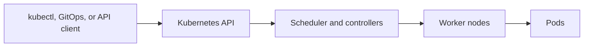

# Kubernetes fundamentals

## In one minute

Kubernetes runs containerized workloads across a group of nodes. Users submit
desired state to the Kubernetes API. Controllers schedule workloads, maintain
replicas, connect services, and report status.

The Kubernetes API—not an individual node—is the main operational interface.

## The cluster

A Kubernetes cluster has two main parts:

- The **control plane** stores desired state and runs the API server, scheduler,
  and controllers.
- **Worker nodes** run application pods through the kubelet and container runtime.



On NKP, Cluster API manages the VMs and Kubernetes lifecycle around this cluster.
Kubernetes then manages workloads inside it.

## Essential workload objects

### Pod

A `Pod` contains one or more containers that must run together. Pods are
replaceable runtime instances and are normally created by another controller.

### Deployment

A `Deployment` manages stateless pod replicas and rolling updates. Change the
deployment template or its source rather than editing its pods.

### StatefulSet

A `StatefulSet` provides stable ordering and identity for workloads that require
them. It does not make the application data consistent automatically.

### DaemonSet

A `DaemonSet` runs a pod on each matching node. Networking, logging, storage, and
security agents commonly use this pattern.

### Job and CronJob

A `Job` runs work to completion. A `CronJob` creates jobs on a schedule.

## Networking objects

### Service

A `Service` gives a changing group of pods a stable virtual address and DNS name.
Clients connect to the service instead of individual pod IP addresses.

### Ingress and Gateway API

Ingress and Gateway API resources route application traffic into or within the
cluster. A controller implements the requested routing on a proxy or load
balancer.

### NetworkPolicy

A `NetworkPolicy` declares which network connections are permitted. Enforcement
depends on the cluster's CNI implementation.

## Configuration and identity

### ConfigMap

A `ConfigMap` stores non-sensitive configuration for workloads.

### Secret

A `Secret` stores sensitive values in the Kubernetes API. It still requires
appropriate encryption, access control, rotation, and often integration with an
external secret-management system.

### ServiceAccount

A `ServiceAccount` gives a workload an identity for Kubernetes API access.
Role-based access control determines what that identity may do.

## Storage objects

A `PersistentVolumeClaim` requests storage. A `StorageClass` selects the
provisioning behavior. A CSI driver translates the request into storage-system
operations.

Deleting a pod does not delete its persistent volume by default, but reclaim
policy and application behavior must be understood before relying on this for
data protection.

## Resource management

### Requests

Resource requests describe the CPU and memory a workload needs for scheduling.
The scheduler uses requests to select a node.

### Limits

Limits constrain usage. A container that exceeds its memory limit can be
terminated. CPU limits can throttle a workload.

Missing or unrealistic requests make cluster capacity and scheduling behavior
unpredictable.

### Probes

- A **readiness probe** controls whether an instance receives traffic.
- A **liveness probe** tells Kubernetes when to restart an unhealthy instance.
- A **startup probe** protects slow-starting applications from premature
  liveness failures.

## Namespaces and clusters

Namespaces organize resources inside one cluster. Separate clusters provide a
stronger boundary for lifecycle, failure, upgrades, and administration.

Use a namespace when teams can safely share the cluster. Use separate clusters
when requirements demand independent lifecycle, failure domains, versions, or
stronger isolation.

!!! tip "Field note: start with owner references"
    When troubleshooting a pod, inspect its owner references. Move upward from
    the pod to its ReplicaSet, Deployment, Helm release, or Flux resource until
    you find the declared source that should be changed.

## Useful inspection commands

```bash
kubectl get pods -A
kubectl describe pod <pod-name> -n <namespace>
kubectl get events -n <namespace> --sort-by=.lastTimestamp
kubectl api-resources
```

These commands inspect state. They do not replace understanding the controller
that owns the resource.

## Continue

- [NKP in 10 minutes](nkp-in-10-minutes.md)
- [Clusters](../architecture/clusters.md)
- [Networking](../architecture/networking.md)
- [Storage](../architecture/storage.md)
