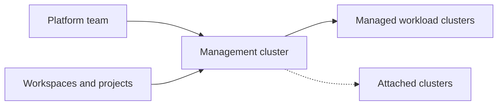
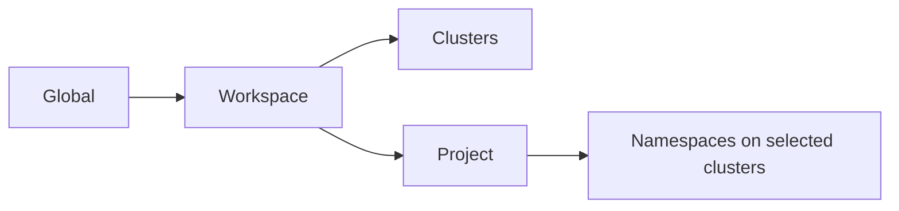

# NKP in 10 minutes

## In one minute

Nutanix Kubernetes Platform (NKP) creates and manages Kubernetes clusters. A
management cluster acts as the control point for a fleet of workload clusters.
NKP uses upstream projects such as Kubernetes, Cluster API, Flux, Cilium, and CSI
instead of introducing a separate proprietary workload API.

## What NKP manages

NKP brings four concerns together:

- **Cluster lifecycle:** create, scale, upgrade, and delete Kubernetes clusters.
- **Fleet organization:** group clusters into workspaces and give teams projects.
- **Platform services:** deploy monitoring, logging, backup, policy, and other
  applications consistently.
- **Infrastructure integration:** connect Kubernetes networking, storage, and
  compute to Nutanix or another supported environment.

## The fleet model

The **management cluster** runs Kommander and lifecycle controllers.

A **managed cluster** is created through NKP. NKP owns its infrastructure
lifecycle through Cluster API.

An **attached cluster** is created elsewhere. NKP can provide supported
management services without taking ownership of its infrastructure lifecycle.

## The organizational model

- A **workspace** is a durable cluster and administration boundary.
- A **project** gives an application team a namespace and configuration boundary
  across selected clusters.

Workspaces are not folders for individual applications. Projects provide that
application-team scope.

## The reconciliation model

NKP stores desired state and uses controllers to make reality match it:

- Cluster API reconciles cluster infrastructure.
- Flux reconciles platform and catalog applications.
- Kubernetes controllers reconcile workloads and services.

If someone manually changes a generated object, a controller may change it back.
The correct fix is usually to update the declared source.

## The infrastructure relationship

Kubernetes does not replace infrastructure. It consumes infrastructure through
standard interfaces:

- CNI for pod networking;
- CSI for persistent storage;
- OCI for container images;
- infrastructure providers such as CAPX for virtual machines and networks.

Nutanix supplies compute, network integration, and data services. NKP supplies
the Kubernetes and fleet operating model above them.

!!! tip "Field note: find the owning controller"
    Before changing an object, determine which controller owns it and where its
    desired configuration is stored. Editing the generated object often fixes
    only the symptom until the next reconciliation.

## Continue

- New to the operating model? Read [Cloud native for system engineers](cloud-native.md).
- New to Kubernetes objects? Read [Kubernetes fundamentals](kubernetes-fundamentals.md).
- Ready for detail? Open the [Architecture overview](../architecture/index.md).
