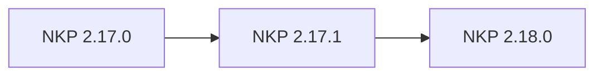

# Upgrade paths

Upgrade guides are separated by target version because supported upgrade
paths, Kubernetes versions, and image requirements vary between NKP releases.

## Sequential upgrades

Use this path when moving an NKP 2.17.0 environment to NKP 2.18.0:

Complete and verify each release before starting the next:

- [Upgrade from 2.17.0 to 2.17.1](2.17.0-to-2.17.1.md)
- [Upgrade from 2.17.1 to 2.18.0](2.17.1-to-2.18.0.md)

!!! warning "Do not skip the intermediate release"
    Treat a direct 2.17.0 → 2.18.0 upgrade as unsupported. Patch releases can
    contain API, component, and migration prerequisites required by the next
    minor release. Only skip a release when the compatibility matrix for the
    exact source and target versions explicitly permits it.

## Before any upgrade

- Confirm that the source and target versions form a supported upgrade path.
- Read the release notes and compatibility information.
- Back up important cluster and application data.
- Check management and workload cluster health.
- Make the target node image available in Prism Central.
- Review the complete version-specific procedure before running commands.

## Choose a workflow

Determine whether GitOps or the NKP CLI owns the cluster definition. Do not use an
imperative CLI upgrade for a cluster whose desired state is reconciled from Git.

!!! warning "Treat an upgrade as a rolling infrastructure change"
    Cluster API can replace nodes during a Kubernetes upgrade. Check application
    replicas, disruption budgets, storage attachment behavior, and spare capacity
    before starting.

Select the applicable upgrade guide from the navigation.

!!! tip "Field note: finish the fleet before moving on"
    Upgrade and verify the management cluster, platform applications, and all
    managed workload clusters to 2.17.1 before introducing the 2.18.0 upgrade.
    Running a fleet across several upgrade stages makes CLI compatibility and
    troubleshooting harder.
